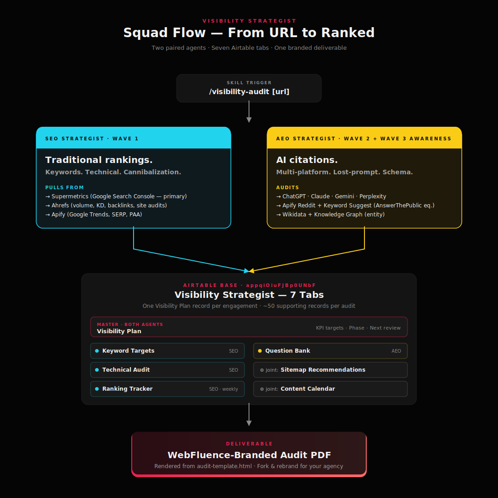

# Visibility Strategist

> A two-agent Claude Code / Cowork plugin that audits a website's visibility across **traditional search rankings (SEO)** AND **AI recommendation engines (AEO)** — ChatGPT, Claude, Gemini, Perplexity, Google AI Overview — then writes a structured plan into Airtable and renders a branded PDF deliverable.

Built for [WebFluence Digital](https://webfluence.digital) as the retainer half of an agency-in-a-box. Pairs with [`webfluence-squad`](https://github.com/webfluencedigital/webfluence-squad) (the build squad) or runs solo on existing sites.



---

## Why this exists

Most SEO tools are dashboards. Most AEO tools don't exist yet. Both problems land on the same desk — the founder of an SME, or the agency they hired — and both need to be solved together. This plugin compresses the work into two paired agents that:

1. **Pull the truth from Google Search Console** (via Supermetrics). Layer Ahrefs for keyword volume + difficulty. Layer Apify SERP for what's actually showing up.
2. **Test across all four major AI assistants** every audit. ChatGPT, Claude, Gemini, Perplexity. Identify lost prompts (queries where competitors get cited and you don't).
3. **Write a structured Visibility Plan into Airtable** — keyword targets, AEO questions, sitemap recommendations, technical audit, content calendar, ranking tracker. Permanent, queryable, retainer-shaped.
4. **Render a WebFluence-branded PDF deliverable** ready to send to a client. Or fork the template and rebrand.

The agents are extracted, not invented — patterns lifted from [msitarzewski/agency-agents](https://github.com/msitarzewski/agency-agents), Dublin SME niche knowledge baked in, voice tuned to the WebFluence brand.

---

## Quick install

```bash
# In Cowork (or Claude Code with plugins enabled):
# 1. Download visibility-strategist.plugin from the latest release
# 2. Install via plugin manager
# 3. Run:
/visibility-audit https://example.com
```

That dispatches both agents in parallel. About 3–5 minutes later you have:
- A populated Airtable base (~50 records across 7 tabs)
- A branded PDF audit deliverable
- A 14-day recheck date set for the next iteration

Detailed install + connector setup in [docs/INSTALL.md](docs/INSTALL.md).

---

## What's in the box

| Component | Count | What it does |
|---|---|---|
| Skills | 1 | `/visibility-audit [url]` |
| Agents | 2 | `seo-strategist` (cyan) + `aeo-strategist` (yellow) |
| Airtable schema | 7 tabs | Visibility Plan · Keyword Targets · Question Bank · Sitemap Recommendations · Technical Audit · Content Calendar · Ranking Tracker |
| Deliverable templates | 1 | WebFluence-branded `audit-template.html` (renders to PDF via WeasyPrint) |
| Worked example | 1 | Battle-test on WebFluence Digital itself — see [examples/](examples/) |

### The two agents

**`seo-strategist`** — Wave 1 (traditional rankings).
Owns: Keyword Targets · Technical Audit. Joint: Sitemap Recs · Content Calendar · Ranking Tracker.
Method: GSC-first via Supermetrics, Ahrefs for volume/KD, Apify SERP for live position checks. **Mandatory cannibalization gate** before any optimisation. Core Web Vitals targets non-negotiable. White-hat only.

**`aeo-strategist`** — Wave 2 (AI citations) + standing knowledge of Wave 3 (WebMCP / agentic task completion).
Owns: Question Bank. Joint: Sitemap Recs · Content Calendar.
Method: 30+ prompts × 4 platforms (ChatGPT, Claude, Gemini, Perplexity) per audit. Lost-prompt analysis. FAQ/HowTo schema specs. Entity optimisation (Wikidata, Crunchbase). 14-day recheck cadence.

The two coordinate through one shared **Visibility Plan** record and the joint Sitemap Recommendations tab.

---

## What it actually produces

A **complete, structured visibility programme** in Airtable, plus a branded PDF.

The repo includes a worked example: the battle-test the squad ran on **WebFluence Digital's own site** in April 2026.

| Output | Count | Where |
|---|---|---|
| Visibility Plan record | 1 | Q2 2026 plan with KPI targets and review dates |
| Keyword Targets | 8 | "web design dublin" (KD 32, vol 880), "seo dublin" (KD 38, vol 1100), "how much does a website cost ireland" (KD 16, vol 480), etc. — all with target page, intent, priority |
| AEO Questions | 8 | Real questions from PAA + AnswerThePublic + Reddit, each with answer draft + recommended schema type |
| Sitemap Recommendations | 10 | The proposed multi-page architecture (currently 1 page → proposed 10 pages), each with primary keyword + schema spec + internal linking |
| Technical Audit issues | 8 | 3 Critical, 4 High, 1 Medium — sourced from Lighthouse + manual schema review |
| Content Calendar posts | 12 | 90-day cadence of pillar/cluster posts, each tied to a keyword AND a question |
| Ranking Tracker baselines | 6 | Critical + High keywords seeded for weekly tracking |

**The deliverable PDF** for the WebFluence Digital battle-test is in [`examples/webfluence-digital-visibility-audit-2026-04-25.pdf`](examples/webfluence-digital-visibility-audit-2026-04-25.pdf). 8 pages, WebFluence-branded, generated by WeasyPrint from the squad's HTML template.

---

## Tools the agents lean on

This is plumbing, not magic. Connect the data sources, get the output.

| Tool | Role | Status |
|---|---|---|
| **Supermetrics** | GSC + GA4 — primary intelligence source | Recommended |
| **Ahrefs** | Keyword volume, difficulty, backlinks, site audits | Recommended |
| **Apify** | Google Trends Scraper, Google SERP Scraper (PAA + featured snippets), Reddit Scraper, Keyword Suggest Multi (AnswerThePublic equivalent) | Required |
| **Airtable** | Output destination | Required |
| **WebFetch** | Wikidata, schema validators, Rich Results Test | Built-in |
| **Bash** | Lighthouse runs (`npx lighthouse`) | Built-in |
| **Claude in Chrome** | Live ChatGPT / Claude / Gemini / Perplexity audits when API access unavailable | Recommended |

The agents are written to fall back gracefully — if Supermetrics isn't connected, they use third-party SERP scrapers. The output is stronger with all of them live, but the squad runs without any one of them.

---

## Branding & customisation

**The plugin ships with WebFluence Digital branding** as a worked example, not as a constraint. The `deliverables/audit-template.html` uses tokens from [`brand-card.html`](https://github.com/webfluencedigital/webfluence-digital/blob/main/brand-card.html) — the cinematic dark theme with the `#E9204F` accent.

To rebrand for your own agency, replace these tokens in `deliverables/audit-template.html`:

```css
/* WebFluence palette — replace with your own */
background: #050505;       /* page bg */
background: #141414;       /* card bg */
color: #F2F2F2;            /* primary text */
color: #8A8A8A;            /* muted text */
color: #E9204F;            /* accent */
border: 1px solid rgba(255,255,255,0.07);  /* subtle border */
font-family: Poppins, sans-serif;  /* display */
font-family: Inter, sans-serif;    /* body */
```

The Dublin SME niche knowledge in the agent files (`agents/seo-strategist.md`, `agents/aeo-strategist.md` — the "Standing knowledge" sections) is similarly an example. Fork the agent prompts, swap in your own niche patterns. PRs welcome for new niche packs (see [CONTRIBUTING.md](CONTRIBUTING.md)).

---

## Project status

**v0.1.0** — initial release, April 2026. Battle-tested on WebFluence Digital's own site. Ready for community feedback. Not yet production-tested across multiple agencies.

Known limitations:
- AI citation audit currently relies on `WebSearch` + Claude in Chrome — no direct API access to ChatGPT / Gemini / Perplexity for programmatic citation testing yet.
- Schema validation requires manual `WebFetch` to validators — could be tightened with a dedicated MCP.
- Wave 3 (WebMCP / agentic task completion) is referenced as standing knowledge in `aeo-strategist` but not yet implemented as its own agent. Likely the next milestone.
- The 10-record-per-Airtable-write limit means content calendars over 10 posts split across multiple writes — already handled in the skill, mentioned for transparency.

---

## Pairing with `webfluence-squad` (the build squad)

[`webfluence-squad`](https://github.com/webfluencedigital/webfluence-squad) is the sibling plugin — eight agents that take a brief and produce a complete deployed website in 7 days. When a client buys both build + retainer, the visibility squad runs **upstream** of the build squad's Phase 2:

- `Sitemap Recommendations` → fed to `visual-storyteller` as the page list to scene
- Primary Keyword + Schema Markup per page → fed to `ux-architect` as URL slug + JSON-LD spec
- Top AEO questions → fed to `visual-storyteller` as required FAQ scene content

Net effect: the new site ranks the day it goes live, not three months later.

Senior PM in `webfluence-squad` references this consultation in its upsell matrix. Both plugins are designed to compose; neither requires the other.

---

## Feedback wanted (RoboNuggets readers, this is for you)

This is the first community release. The plugin works on WebFluence Digital's own site (proof in [`examples/`](examples/)) but it has **not** yet been tested across multiple agencies, niches, or platforms. Specific things I'd love thoughts on:

1. **Is two agents the right shape, or should this split into three (SEO / AEO / Wave 3 WebMCP)?** Current bet: keep it two, fold Wave 3 awareness into AEO. Alternative: ship a third agent now and own Wave 3 early.

2. **Is the cannibalization gate the right blocker?** Current implementation makes the SEO agent refuse to advance until a cross-page query map is clean. Strict, but it prevents the most common SME SEO mistake. Too strict for community use?

3. **What niche packs would you actually use?** The Dublin SME niche knowledge is built into the agents (dental, gym, restaurants, trades, property, professional services). Would a niche-pack mechanism — fork-friendly per-niche files in `agents/niches/` — help if you're running this in a different geography or vertical?

4. **The deliverable PDF format — useful or overkill?** Some clients want a PDF; some want a Notion doc; some want a live Airtable view. Does the WebFluence-branded PDF default fit, or should the rendering layer be more pluggable (Notion API, Slides, raw markdown)?

5. **Anything fundamentally broken in the Wave 1/2/3 framing?** The framing comes from observing how AI-driven acquisition is shifting. If you've shipped or measured against this, I'd love to know if the model lines up with reality.

Open issues, drop a discussion, or fork and PR. See [CONTRIBUTING.md](CONTRIBUTING.md).

---

## Provenance

- Senior orchestration patterns adapted from [msitarzewski/agency-agents/marketing/marketing-seo-specialist.md](https://github.com/msitarzewski/agency-agents/blob/main/marketing/marketing-seo-specialist.md), [marketing-ai-citation-strategist.md](https://github.com/msitarzewski/agency-agents/blob/main/marketing/marketing-ai-citation-strategist.md), and [marketing-agentic-search-optimizer.md](https://github.com/msitarzewski/agency-agents/blob/main/marketing/marketing-agentic-search-optimizer.md).
- Voice extracted from records in the WebFluence Development Airtable base used to build [webfluence.digital](https://webfluence.digital).
- Battle-test data from the WebFluence Digital Q2 2026 visibility plan — Airtable base `appqiOiuFJBp0UNbF` (private to WebFluence; the rendered PDF is public in `examples/`).

---

## License

MIT. See [LICENSE](LICENSE).

If you ship this in a paid retainer engagement and the framework helped, a link back to this repo or a mention to [@dusanwalla](https://x.com/dusanwalla) on X / [LinkedIn](https://linkedin.com/in/dusanwalla) is appreciated. Not required.

---

**Built by [Dusan Walla](mailto:dusan.walla@webfluence.digital) for [WebFluence Digital](https://webfluence.digital). Dublin, Ireland.**
